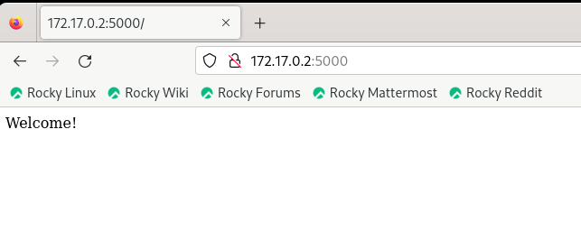
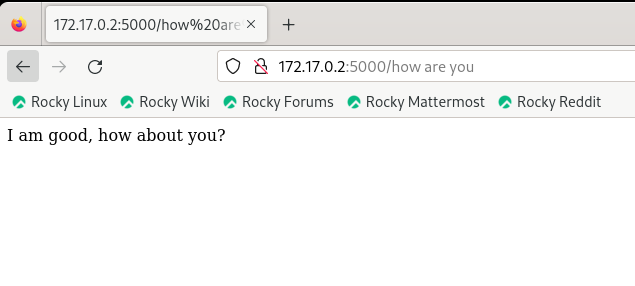

# Simple_webapp_flask
## Docker practice from Mumshad Mannambeth

 Below are the steps required to get this working on a base linux system.

1. OS - Ubuntu
2. Update apt repo
3. Install dependencies using apt
```bash
   apt-get update
   apt-get install -y python
```  
4. Install Python dependencies using pip
  ```bash
apt-get install python-pip
pip install flask
pip install flask-mysql
```
5. Copy source code to /opt folder
6. Run the web server using “flask” command
```bash
FLASK_APP=app.py flask run --host=0.0.0.0
```
## Test
Open a browser and go to URL
```
http://<IP>:5000                            => Welcome
http://<IP>:5000/how%20are%20you            => I am good, how about you?
```



# Note
If you run the container with the `--host=...` flag, it means that the web server inside the container will be accessible from any IP address on the internet.

So, if someone wants to access your web server from their computer, they can simply open their web browser and enter `http://ContainerIP:5000`. This will allow them to access the content served by your Dockerized web server.
